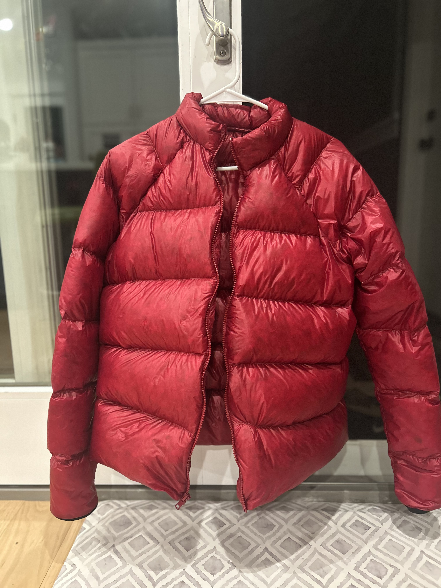

# Materials
3-4 ish yards of membrane .66, YKK #5 vislon zipper and stoppers, and 5oz of 850FP down.

# Process
I used the LearnMYOG pattern and combined the front, side gusset, and back all into one pattern, then mirrored it along the back and then down the hem to make one big piece for the body. I left the arms unchanged and cut out 4 pieces. I sewed 5" horizontal baffles, modeled after the SUL 1.1. The collar was just a rectangle. After stuffing I simply sewed on the arms and collar, binding the raw edges at each step with a 1.5" strip of membrane. I didn't add shock cord to the bottom hem as I've never found it necessary on other jackets and my rain shell has one anyway.

# Sizing
I sized up a 1/2 size on the pattern (my chest size is 38" and I used the 40"), expecting it to shrink not too much width wise but quite a bit height wise. I can fit several fleeces underneath and it should be a great jacket for winter in the Whites, but I don't think I'm winning any fashion contests with this one. I didn't lengthen the pattern at all, which worked because my torso is shorter proportionally than what would be expected by my chest size.

# Stuffing
Down is not my favorite thing to work with, and whoever said it was satisfying has a weird sense of fun, haha. Initially I was going for only about an inch of loft, but then I basically just stuffed it until I couldn't see light coming through the baffles. I probably should have calculated the down amount per baffle, but I was lazy and I don't know how much of a difference it would have made.

Ended up where the baffles have approx 1.75" loft, and 7.8oz which is pretty similar to a medium sized Timmermade SUL 1.5.

# What I would change:
* Both the arms and the collar feel a bit small after being stuffed
* Maddeningly, I couldn't get the baffles on either side of the zipper to align, which makes the jacket look sort of goofy. I guess I didn't sew the baffle lines straight?
* I still wish I had overstuffed it a bit more, and since the baffles are so long the down does tend to migrate somewhat.
* I don't think it was necessary to use the LearnMYOG pattern (which is a raglan style jacket) - it might have been easier to just trace out an oversized shirt, and then make the arms simple cylinders.
* The bound seams are a bit itchy on bare skin, but it shouldn't really be an issue.

This was a project that I wanted to finish before heading to the Himalayas for several months, so I ran out of time to add a hood. I think i should still be able to add one using kam snaps in the future, or just make a down balaclava.

Overall, as someone who has only been sewing for less than a year, this wasn't too hard, just quite tedious with all of the pieces and the stuffing. And the jacket is super warm and cozy!

