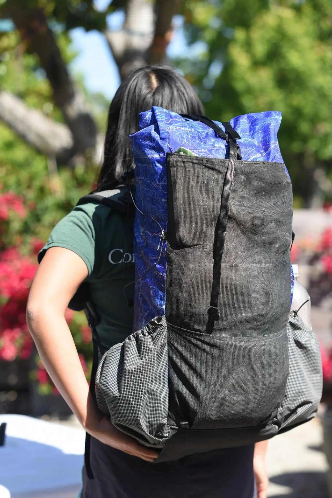

# Update (Jan 2026)
Having made many more packs at this point, I have since seam-ripped and redone this pack. New blog post coming later.

# Why?

Primarily, vanity. I wanted a lighter pack, and one that was unique. Secondly, I struggled with shoulder pain on my Flash 55 (torso too small) and LiteAF Curve 46 pack (torso probably too large, and the load lifters don’t connect to the frame for some reason). My Kakwa 55 pack has exceptionally good weight transfer and was quite comfortable, but is about 10 oz heavier than I would like and I wanted more pockets accessible while hiking \- the shoulder strap pockets are difficult to use, it has no bottom pocket, and the front mesh pocket is too small. Also, everyone has a Kakwa and I wanted to be \#different.

Specs

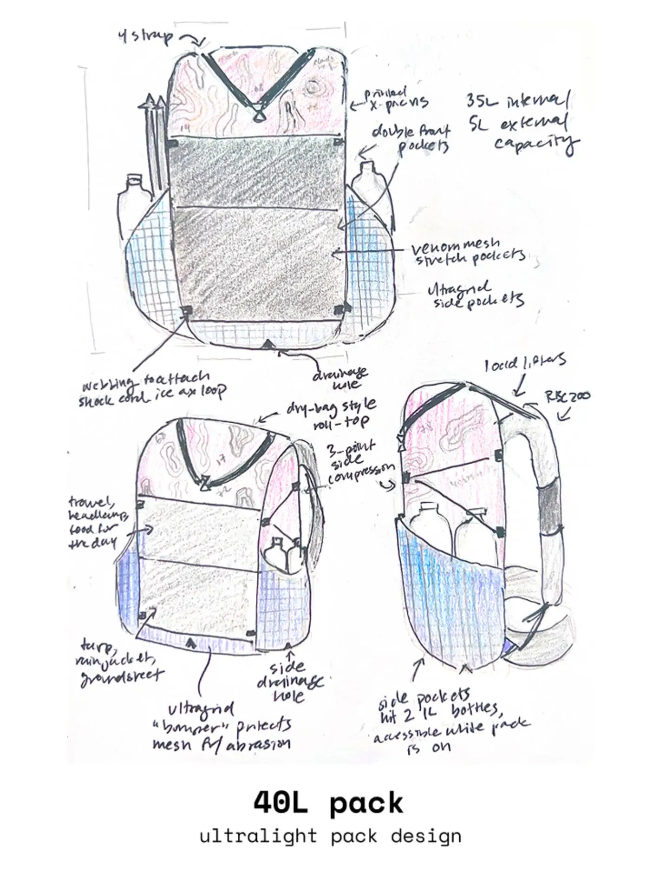

* 40L internal, additional 5L external capacity
* 19oz (frameless)
* 24oz (with hip belt)

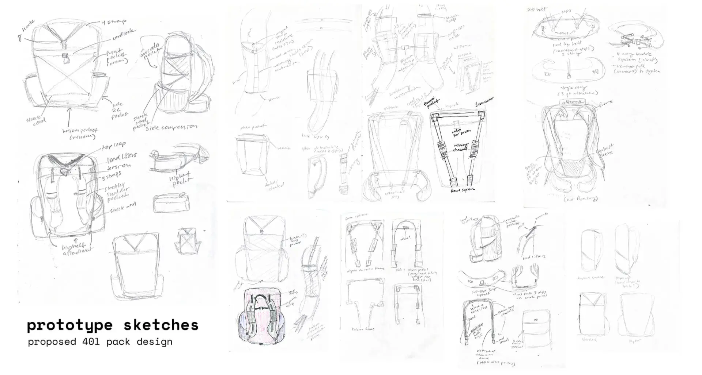

Materials

* X-PAC V15 (custom printed)
* Venom Gridstop Eco (not ultragrid, but feels very similar)
* Venom Stretch Mesh
* Lycra Mesh
* Old leggings
* 1/2” webbing
* 3/32” Shock Cord
* 1/2” Ladderloc
* Cord locks
* Lineloc 3
* 1/16” Paracord
* 1” Gatekeepers
* 1/2” Triglides
* 7075 Easton Tubing Aluminum
* Flat elastic
* Grommets
* 3/8” (10mm) Stansport Camping mat
* 70D Ripstop from Joann’s
* …and some other things I’m probably forgetting

Sourced from Ripstopbytheroll, Quest Outfitters, Amazon, and Joann’s :(

# Prototyping
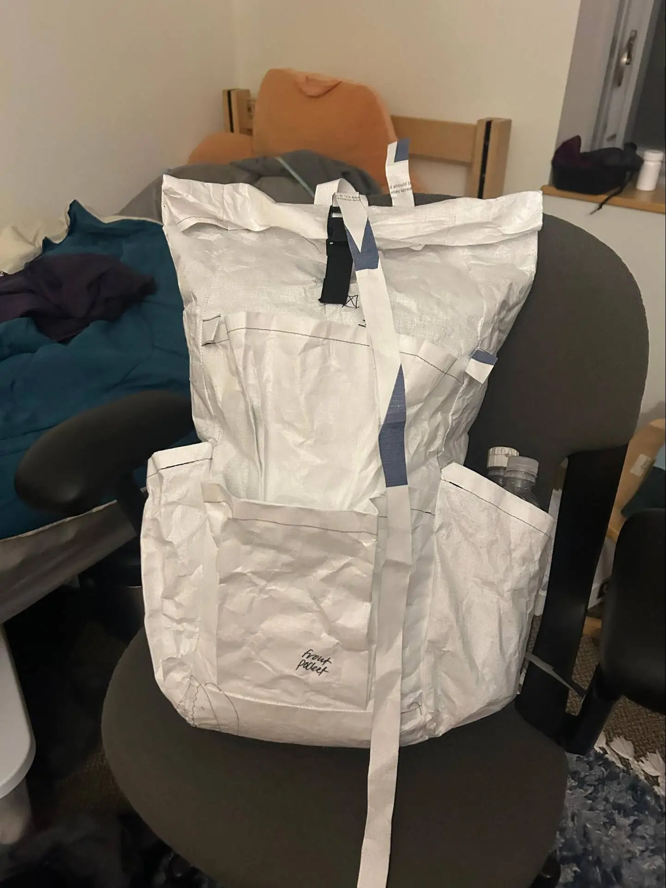

I borrowed a roll of Tyvek from the Olin outing club to prototype. I used the Prickly Gorse 40L framed pattern with several modifications that I’ll note below. I couldn’t get the poster printer to print the A0 size pattern correctly, so I printed the pattern on letter paper and spent several hours taping everything together.

I didn’t use any foam, webbing or hardware on the prototype, other than a cheap buckle. As a result I didn’t actually test a lot of the modifications I was making. It didn’t really end up being that much of an issue.

I realized the internal capacity of the prototype was quite small (35L), so I extended the roll top of the final by about 5 inches, or approx 5L.

# Making

## Front pockets

One thing I disliked about the massive, opaque venom stretch pocket on my LiteAF pack was that it would always take me forever to find anything. This became an actual problem every time I had to dig a cat hole and would be frantically searching for my trowel and TP. I decided that I would instead add 2 half pockets, the bottom would have my tarp and groundsheet, and the top would have all the small things.
]

After basting on the double pockets, I spent several weeks worrying that the pockets were simply too small and wouldn’t be all that functional. I couldn’t remove the bottom one since I had already stitched the front and bottom panels together, but I seam ripped off the top pocket and replaced it with a much larger pocket. Since I had already created several rows of holes because of sewing mistakes in the XPAC and didn’t want to create another one by adding the pocket again, I decided to make the top pocket open on both the top and bottom \- similar to the HMG Unbound’s double pockets. It gives me a place to put small things, and I can also access the items at the bottom of the top pocket easily. I also added a Palante style stake pocket to the top left since I had some leftover venom.

### Side pockets

I debated whether to use my leftover purple EPX200 from another project, but woven fabrics are supposedly better for side pockets (less stiff) so I used Venom gridstop for these. I was hoping to use the soft purple gridstop, but had a mixup with my order that resulted in having 3 yards of black gridstop instead. Oh well, it ended up looking nice anyway.

I added grommets as drainage holes and for threading elastic cord through the top of the pockets, to keep water bottles on. The pockets hold smartwater bottles reasonably well, but I think the cord I bought was too stretchy \- it’s difficult to tighten. I’ll replace it with a thicker, less stretchy elastic soon.

### Shoulder straps

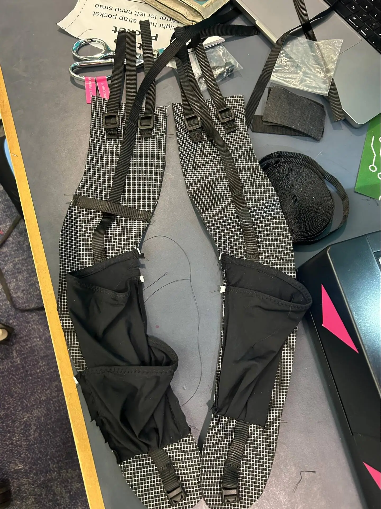

I added a second shoulder pocket on the left shoulder strap, as well as a piece of webbing to hook a garmin. The second pocket had to be small enough to not get in the way of the first pocket, so it carries my bandana, sunscreen, and lip balm. I think these are super functional enhancements and I’m very happy with them.

I personally dislike spacer mesh - I don’t think it does anything other than rub uncomfortably on my shoulders. I used Lycra mesh and old leggings instead for the strap base. While I noticed some sweat on the underside of the straps during my test hikes, it honestly wasn’t a big deal and not all that different from using spacer mesh.

I worried a lot about getting the shoulder strap angle and shape right on the first try, so I decided to add the Nashville style attachment with a daisy chain and 3 triglides. See this link for an explanation of how Nashville does it (or used to do it \- now they use a different type of daisy chain). It was very difficult to sew the daisy chain into the seam with only 1” webbing \- next time I might just sew the bartacks directly into the XPAC. I hope it holds up. The daisy chain also looks not the best, but that’s okay.

### Y strap

LiteAF packs have a Y strap that is constructed of 2 pieces of webbing, sewn together at the intersection of the “Y”. It’s a bit difficult to explain, but it means that if I’m trying to lash a bear can to the top, tightening the pack from all 3 sides involves pulling upwards (towards me), rather than pulling downwards at the bottom of the “Y”. This is a genius move on their part in my opinion and I copied it for my pack.

### Bottom pocket

This is so handy. I’ve never had one on my previous packs, but have always been jealous. I added a trash pocket as well and it’s so convenient to store snacks.

(Unfortunately when the pack is in daypack mode, the bottom pocket isn’t usable)

## Hip belt

I really like the zippered hip belt pockets for ensuring my stuff doesn’t fall out, but in reality 95% of the time I leave them open while hiking \- I like to stuff large cheez it’s bags and snack while walking. If I need something to stay in, I’ll use my fanny pack. I decided to use simple stretch fabric pockets instead. I also loved the 4 way V style inward pull buckle that Durston packs use so I replicated that as well.

I’d heard some great things about the SWD packs weight transfer, and how floating hip belts add for significantly more hip freedom. I decided that the hip belt would be attached via 4 gatekeepers and webbing loops, two on the side and two in the middle directly behind the frame stays, like the Long Haul. Theoretically this allows for good weight transfer. (Note that the NUL Sundown does something similar, but only attaches on the side rather than the bottom where the stays are. Although that is more convenient, I was worried it might cause the weight to sag below the hip belt)

## Frame

I spent a lot of time debating between different frame styles. I know I’m not UL enough to do a 6-7 day food carry with no frame, and I wanted to be able to use this pack for essentially any kind of trip, including when I need spikes, ice ax, tent inner and a bear can (+5 lbs to base weight essentially).

I knew I didn’t want a frame sheet because it is much heavier than the other options, and none of the truly UL framed packs seem to use one (sorry granite gear). Based on what I could research, inverted U frames (Durston, Pilgirm UL) carry weight far better than single or double stays. The stays should terminate towards the center of your back, not towards the outside of the pack (like KS or the Atom Packs Pulse inverted delrin hoop frame), for best carry.

I used Easton 7075 aluminum tubing (usually for tent poles) and sawed them down to size. 7075 (SWD, Pilgrim) is much stronger than 6061 (HMG/LiteAF) but very difficult to bend to fit your back. I debated whether to purchase pre-bent 7075 stays from Dan Ransom \- this apparently is more comfortable because your shoulder blades won’t contact the stays. However those were expensive and Pilgrim UL Highline and Roan both use straight stays in an inverted U with 3D printed connectors, so I figured it must be fine.

I sewed a frame sleeve into the back panel with a velcro top to cover up the sleeve and add tension. I used 1.5” webbing to make frame holders. I used ripstop for most of it and gridstop for the very top where the frame contacts the fabric. The holders are sewn to the sleeve, not the back panel, so that I can fit a back foam pad for comfort.

The jury is out on whether bending the stays to fit my back is necessary. With padding between my back and the frame, I can’t feel the stays. It does barrel somewhat, like a frameless pack would, but I can avoid that by packing it well.

### Daypack mode

*in daypack mode on a hike through Buckskin Gulch*

The Northern Ultralight Sundown has a set of clips attached to webbing loops on the bottom of the pack to bring the pack bottom closer together, thus distributing weight closer to your back when the pack is mostly empty. I added two webbing loops on the front and bottom panels and used gatekeepers to lock them together.

Combined with tightening the side compression straps and removing the frame and hip belt, this works reasonably well, although packing it well is much more difficult and I am probably going to make myself a vest style daypack soon. I can also attach a shock cord ice ax to these loops for the rare occasions I need it.

## What I like:

* The shoulder straps are extremely well padded and comfortable, especially for frameless mode.
* Being able to adjust the angle and placement of the shoulder straps is amazing \- I can really configure the fit, and I can imagine replacing them with vest style straps in the future.
* The palante stake pocket and double front pockets\! I didn’t know what I was missing until this\!
* Shock cord on the back to attach a sit pad \- it works really well.

## Things I’d do differently:

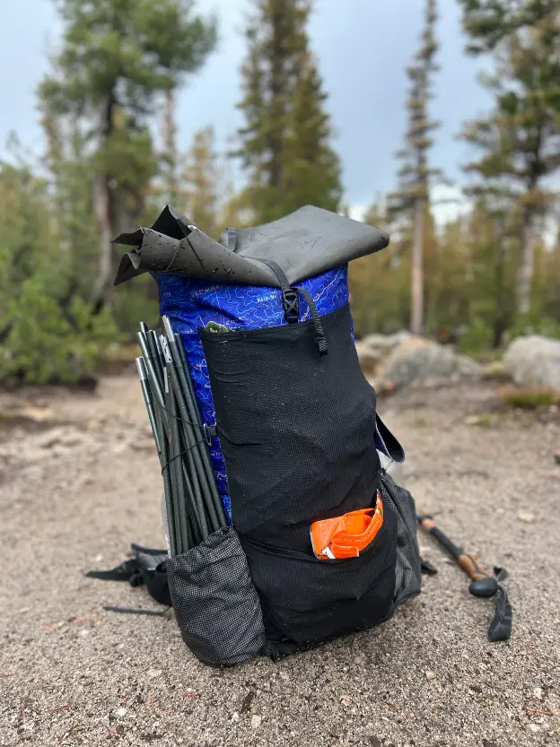

* I’m unsure about the nashville style attachment. It makes the pack look much less clean and the straps are a little harder to get on. I would like to toy with other ways of making straps removable.
* Make the side pockets differently. I would rather use 2 pieces of fabric to make a “cup” rather than this single piece of fabric, which doesn’t really hold 2 smartwaters as well as my Durston pack.
* Potentially use spandura or something stretchier for the front pocket. Even pleated, the venom still doesn’t hold all that much.
* Bring the lineloc loop on the sides a little further down. The side compression straps are very angled, making it harder to hang something like a bandana.
* Get a printed fabric that is a different color than my sun hoodie, fleece, quilt, rain jacket... I own too many blue things and the pack kind of just blends in. (it was supposed to be purple, but unfortunately the print ended up much more blue than I wanted). Maybe a white pack next time?
* Not sew everything last minute before graduation, that was stressful\!

After I finished the pack, I immediately took it on a week long trip through Arizona and Utah using it as a day pack.

## What am I naming it?

I’ve named all of my packs after pokémon. I chose Poliwhirl because it’s medium sized, dark purple/blue, and has swirls just like the topo lines on the pack :)

Here’s to many adventures, Poliwhirl!

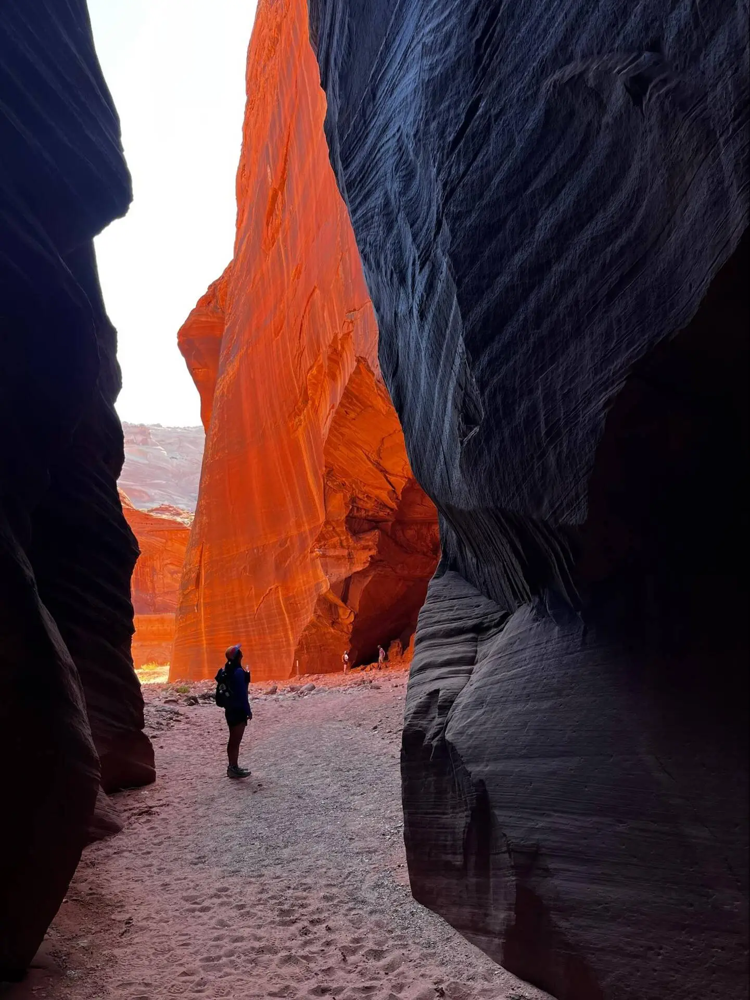

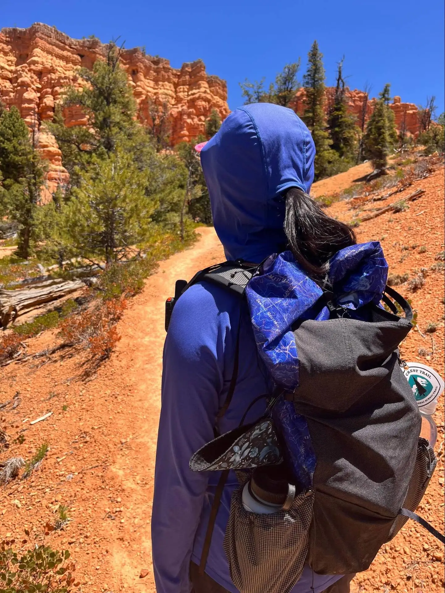

    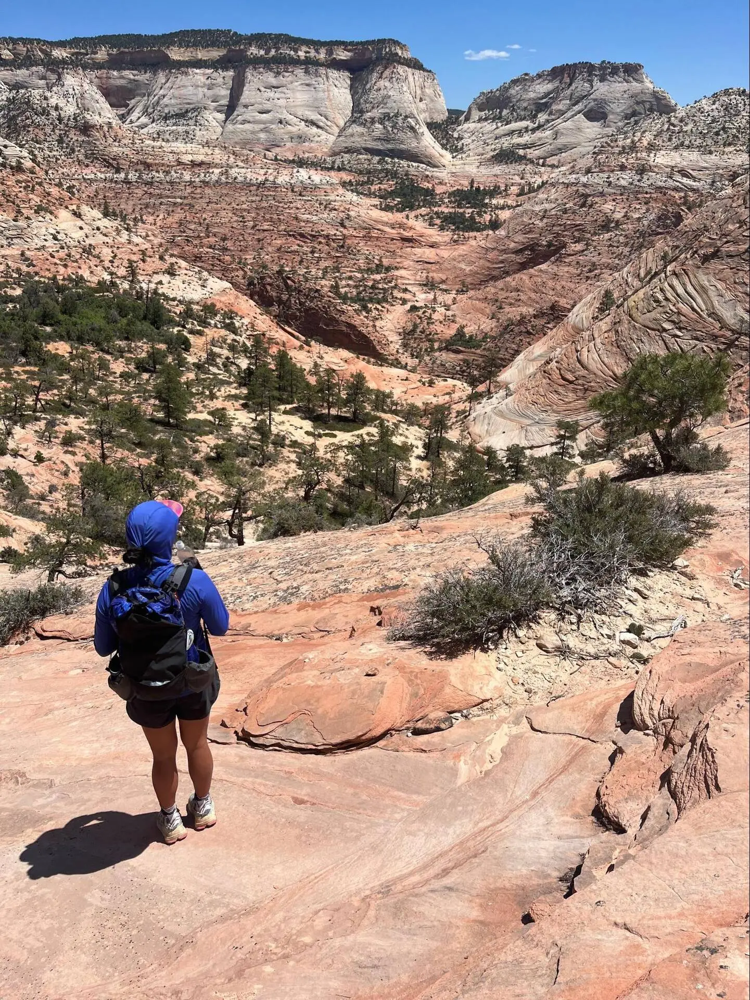
    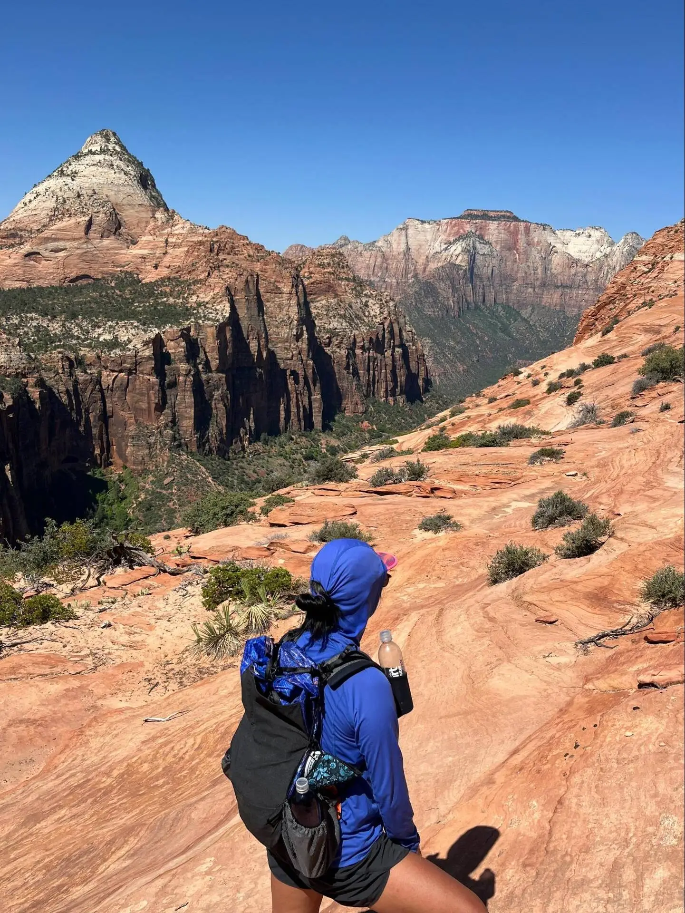
    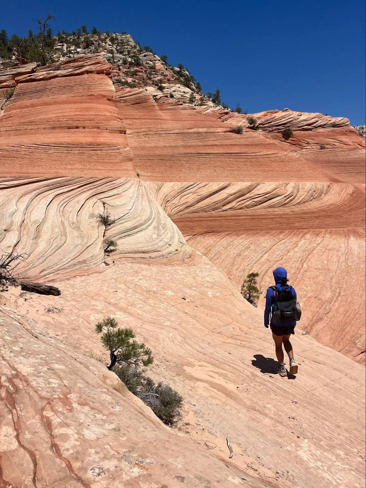

