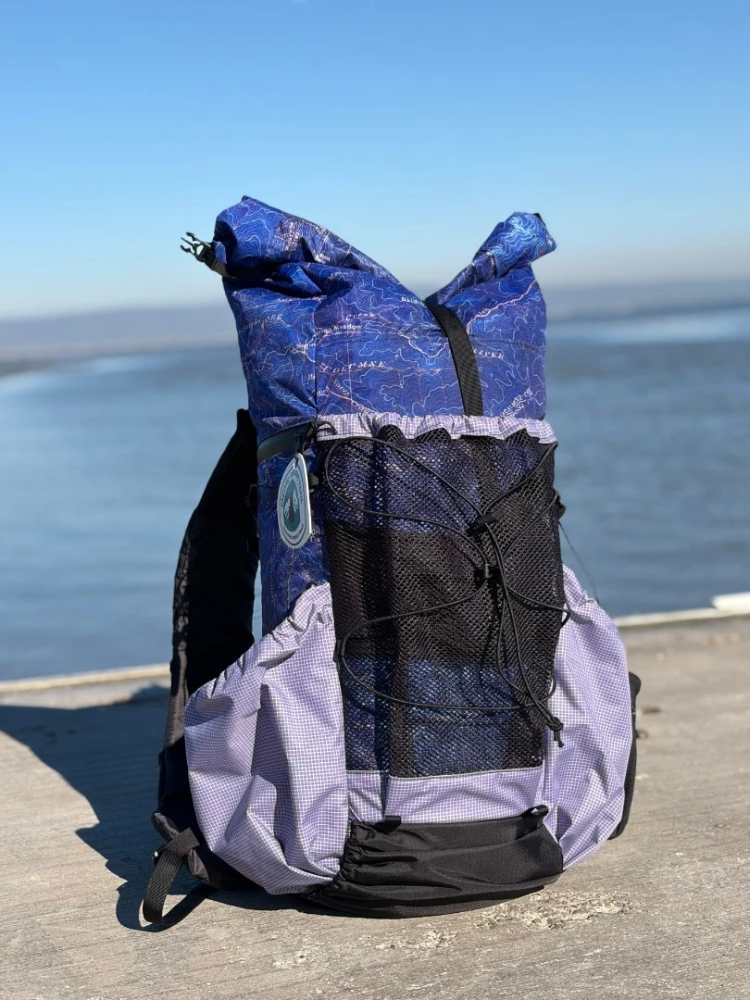
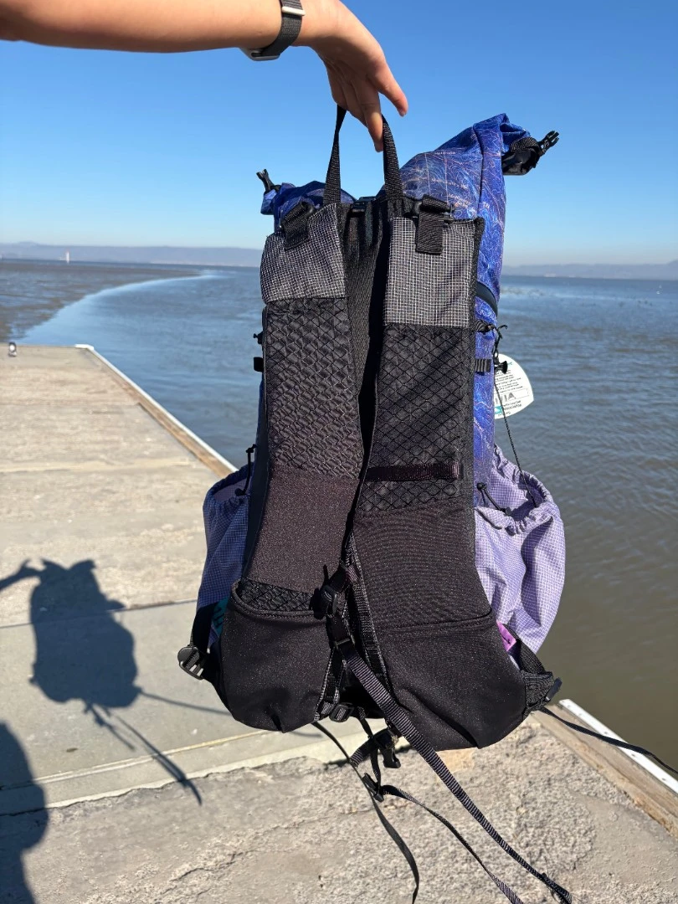
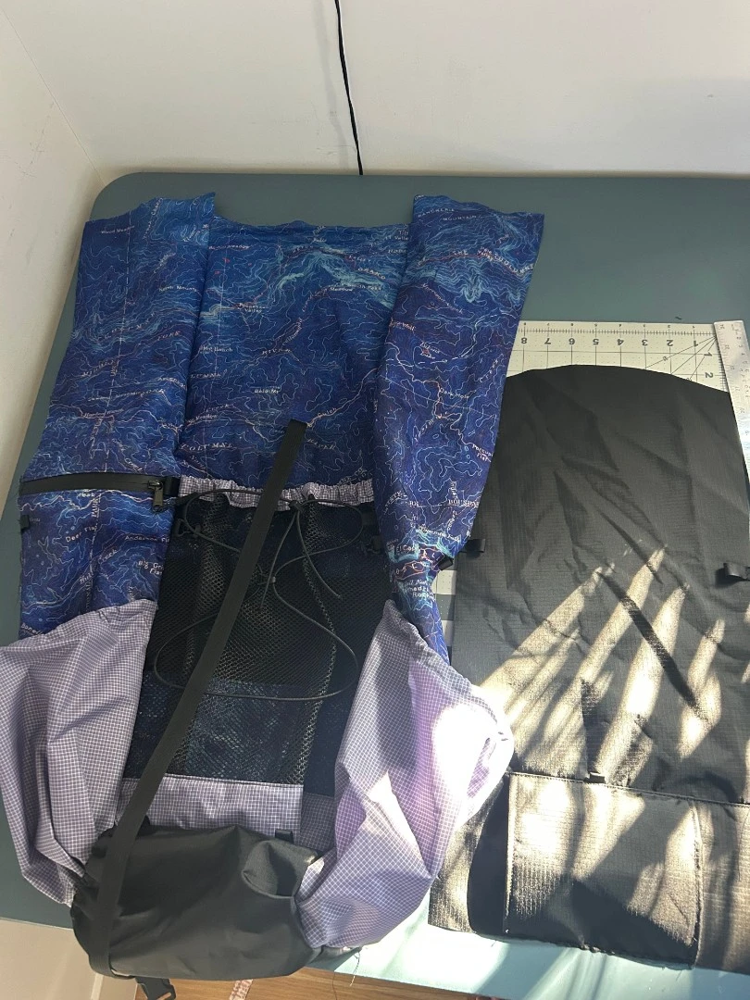
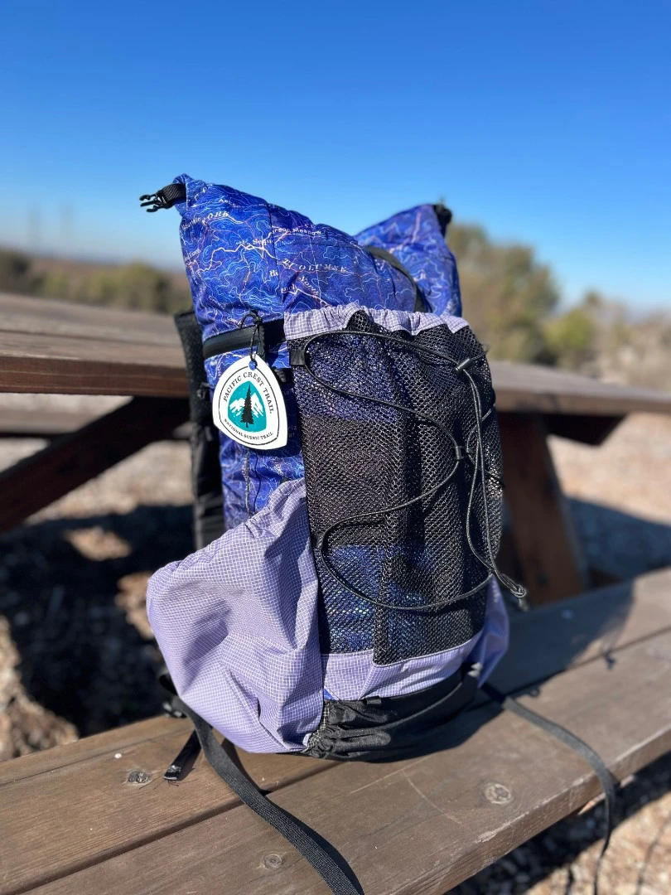
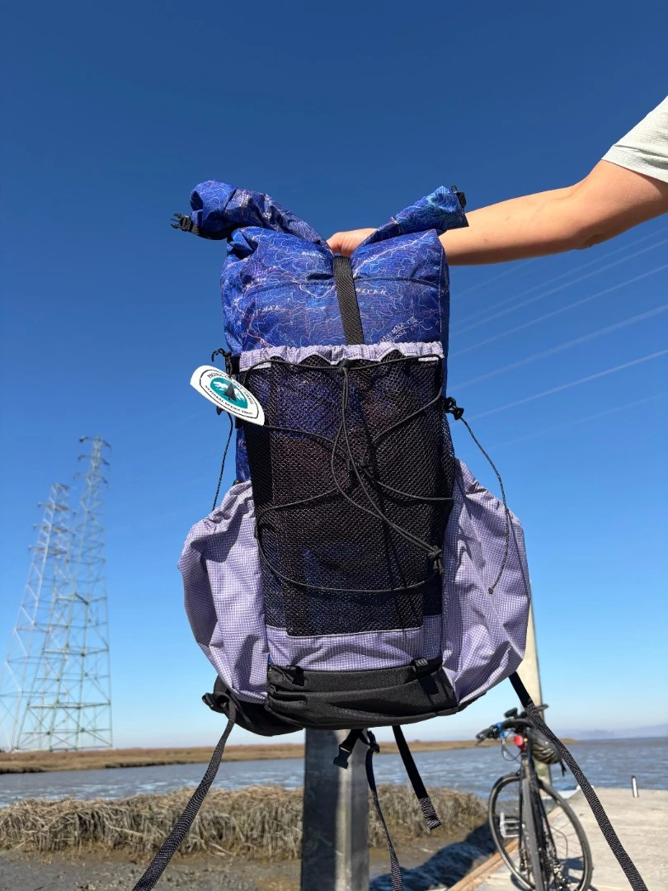

The first pack I ever sewed was a 40L pack with a Yosemite [topo map pattern](/blog/40L-may-2025/). After using it for a season and getting significantly better at sewing, I was unhappy with the quality of the build. The frame system didn't work well and because of the origin design, the stays were slowly creating a hole at the bottom of the back panel. Not ideal.

So I seam ripped the original pack and recovered what I could from the original pack, especially because most of the fabric still looked basically new and the print was too awesome to waste. Some changes:

* Removed the original frame system and made it frameless.
* Changed the venom stretch bottom pocket to a pleated Robic pocket (thanks to the Durston Wapta)
* Removed the original strap attachment system - it made me a bit nervous and I never adjusted them anyway. Replaced with a 1" webbing system to attach straps via a 1" gatekeeper.
* Changed the two venom front pockets into a single pleated polymesh pocket
* Replaced the black venom gridstop with purple :)

