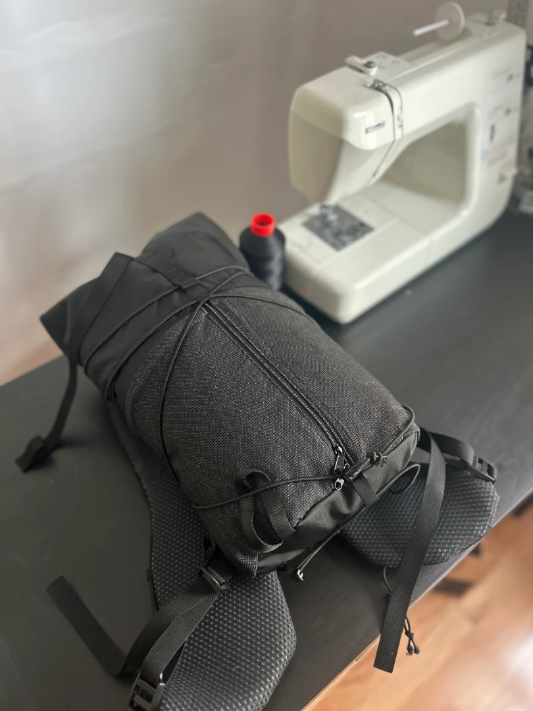
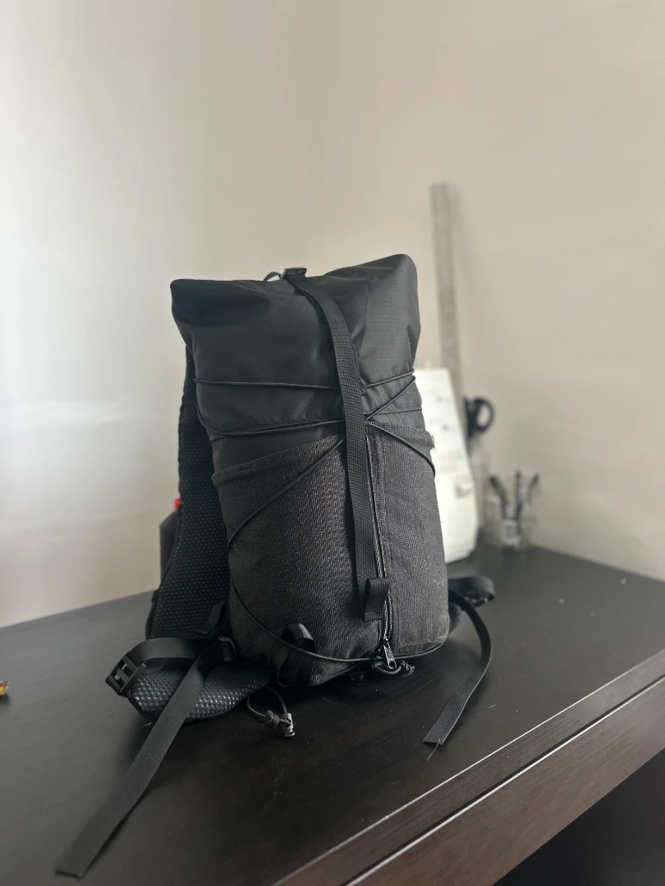
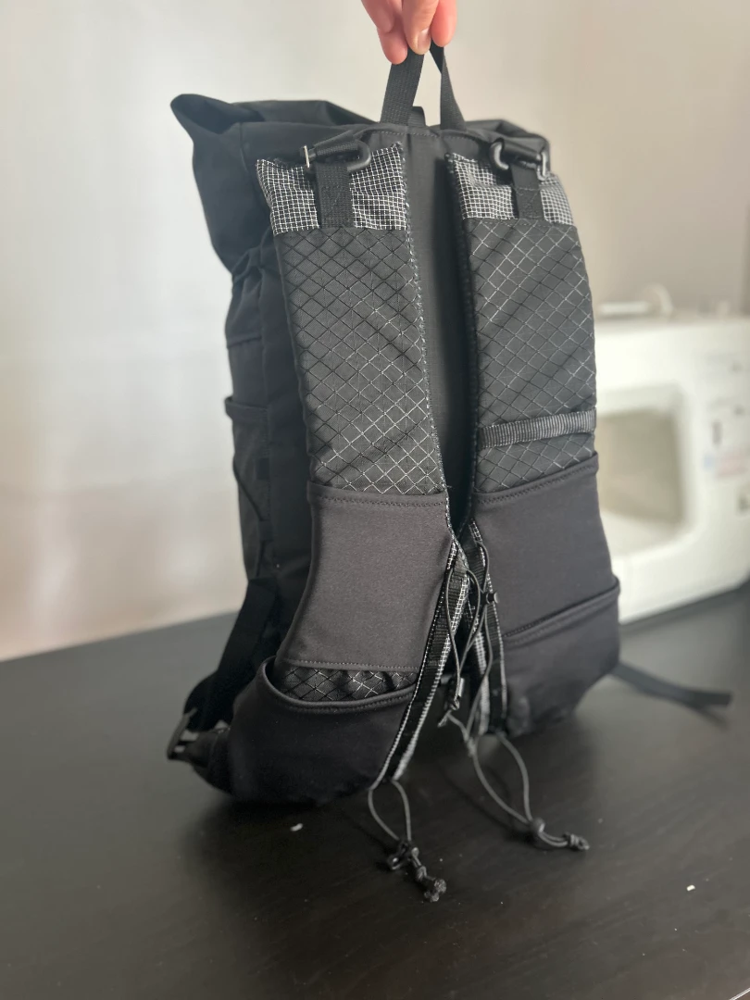
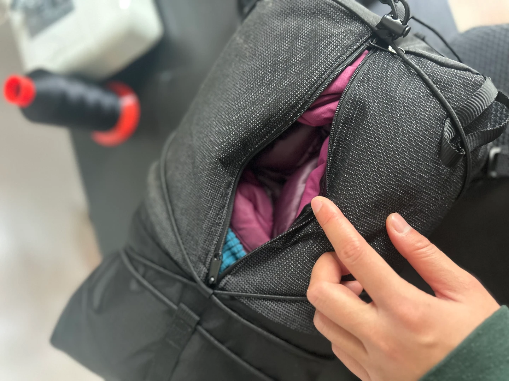
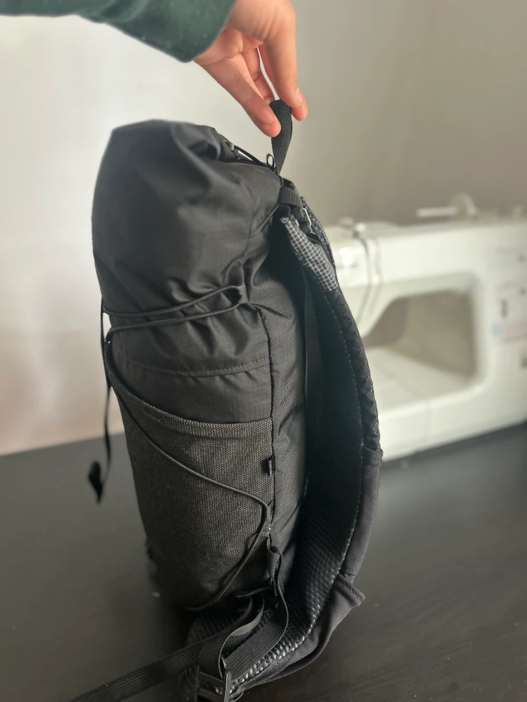
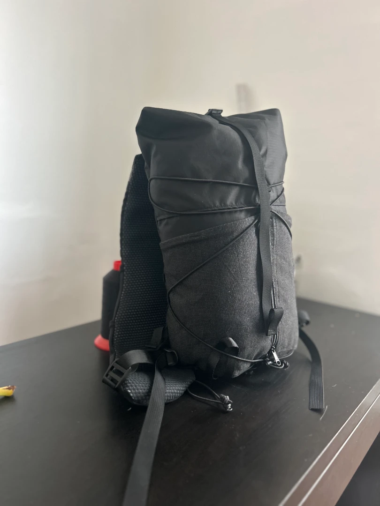
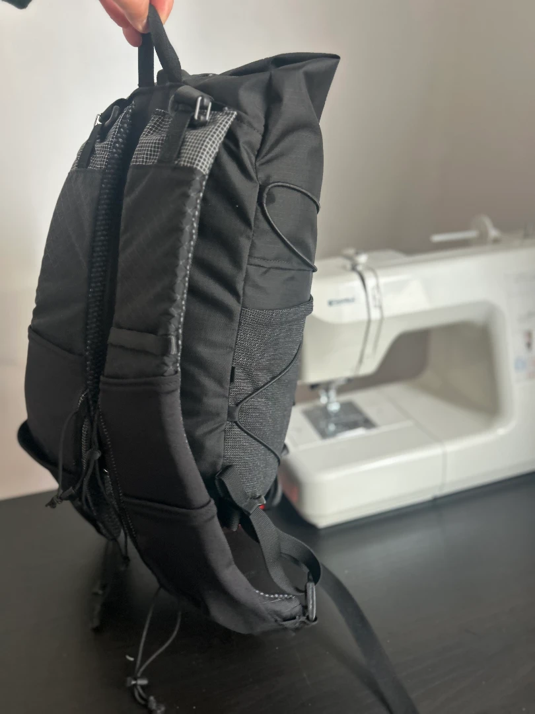
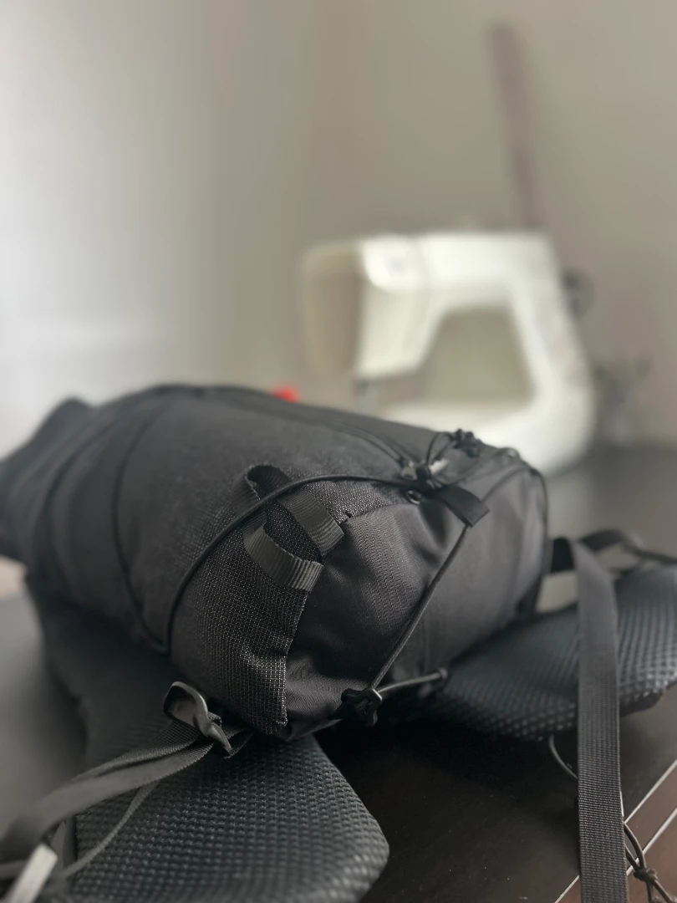

I always get sick in February, so during the 1 week I stayed inside I just sewed and fed my gear addiction.

Why the center zipper? Because I didn't have a wide enough piece of venom to cover the pack front. Also it's theoretically more convenient to access gear from a roll top this way.

Looks a lot like a mini joey mixed with a Red Paw Packs Flatiron.

I initially made the straps removable, but after deciding to send this to my friend who tests gear for one of the big gear review blogs, I seam ripped the straps seam and added in a new pair of straps specifically for this pack.

