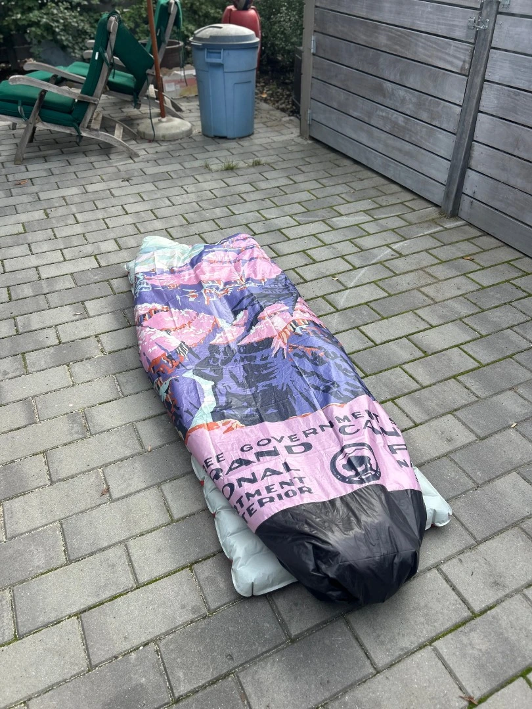
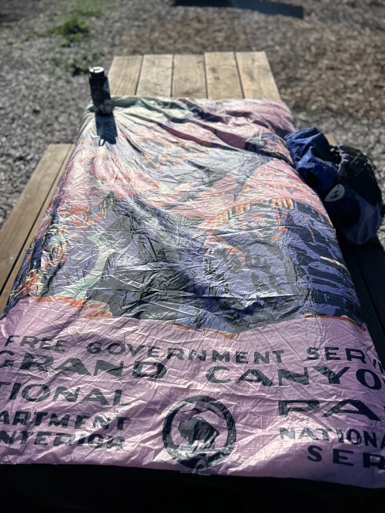

I used 3.6oz Climashield and approx 5 yards total of Membrane 10. This was my first time working with Climashield and it's a hell of a lot simpler than down.

I used a custom print of a WPA-era parks postcard.

It came out quite a bit heavier than I was anticipating. At 22oz, it's the same weight as my 20F quilt. This is likely due to a larger zipper (I used a YKK 5), cord locks, and low-profile center push buckles, and the fact that I oversized it to make it fit my quilt. I may seam rip and turn it into a down quilt one day.

