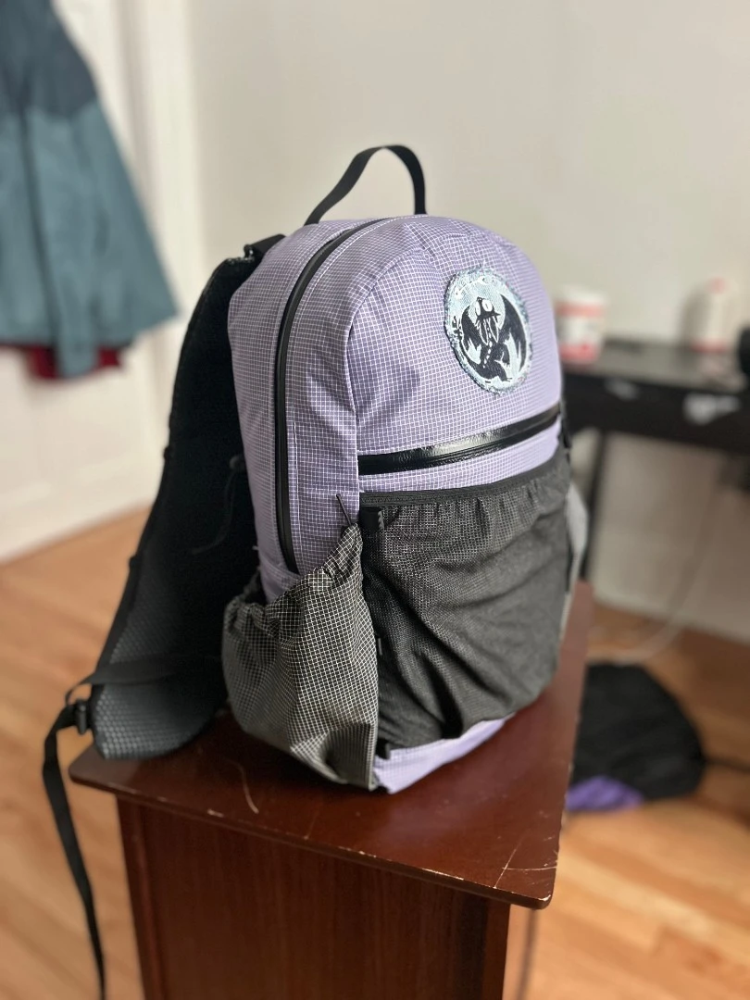
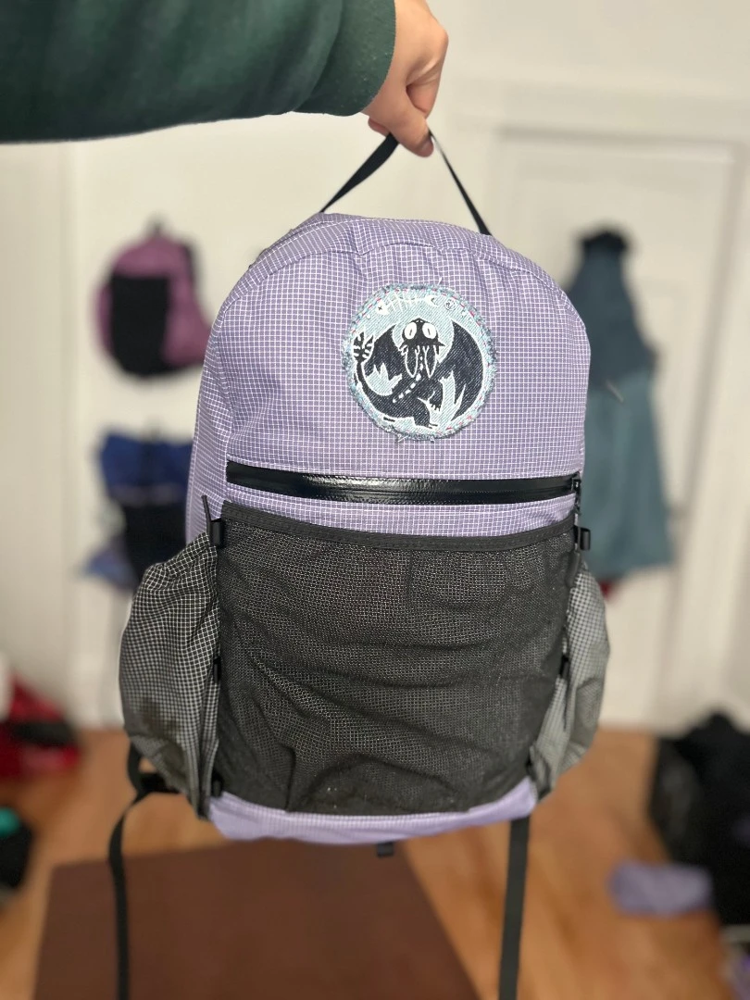
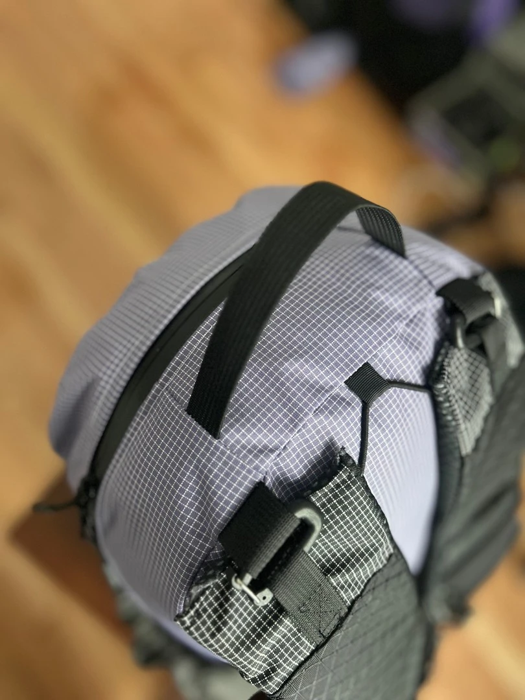
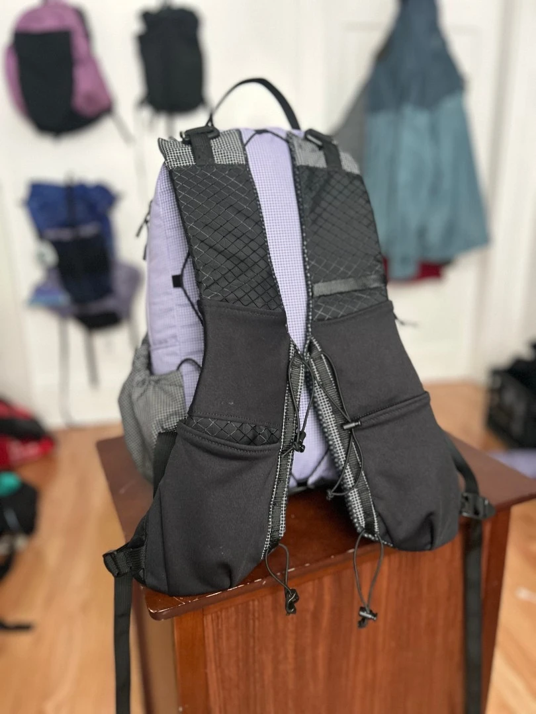
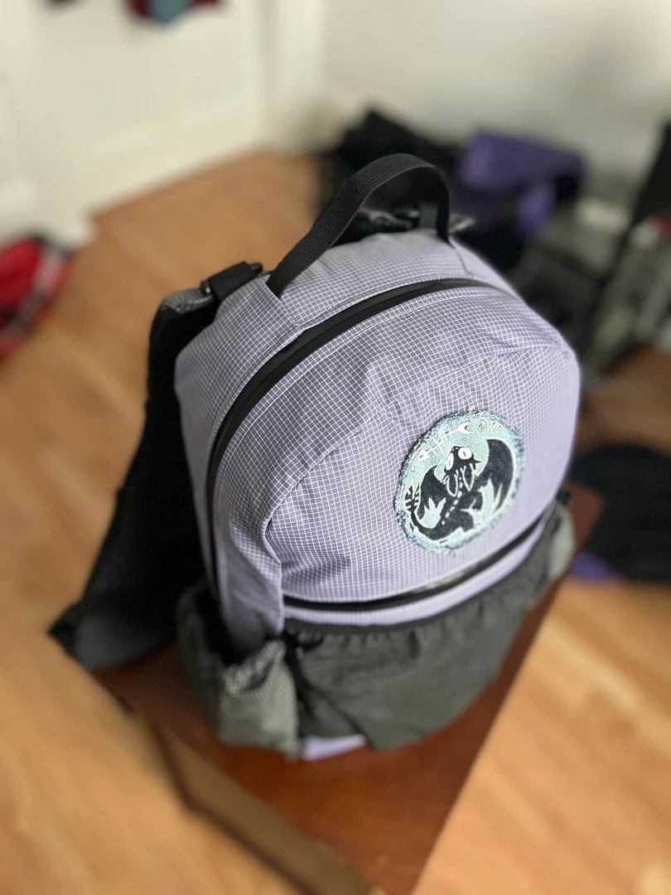
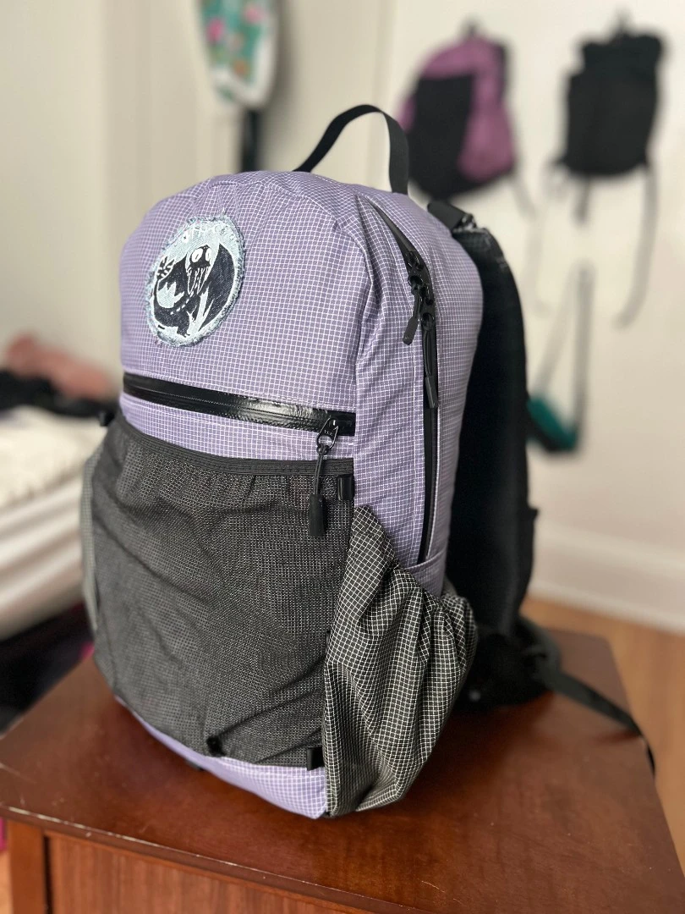
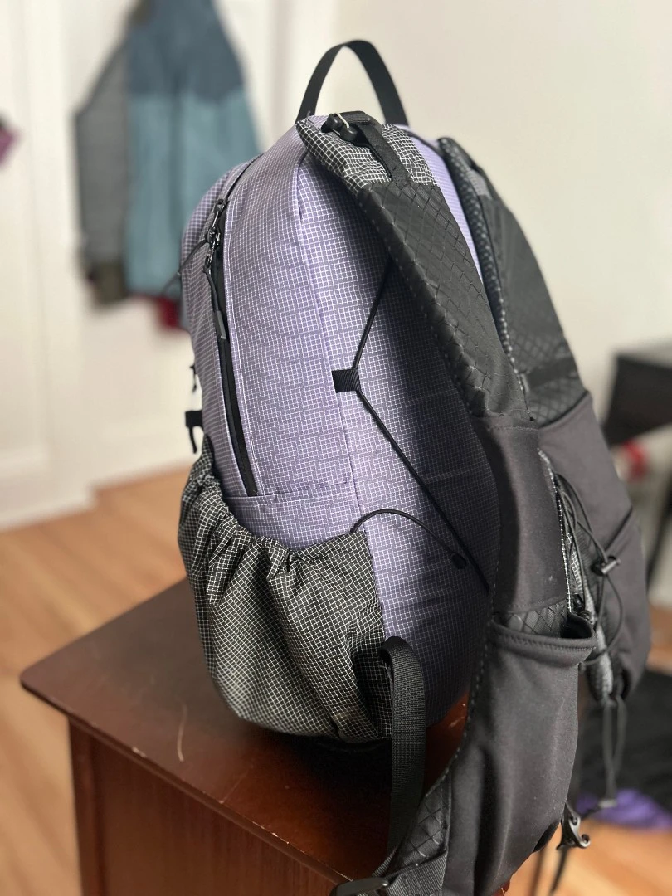
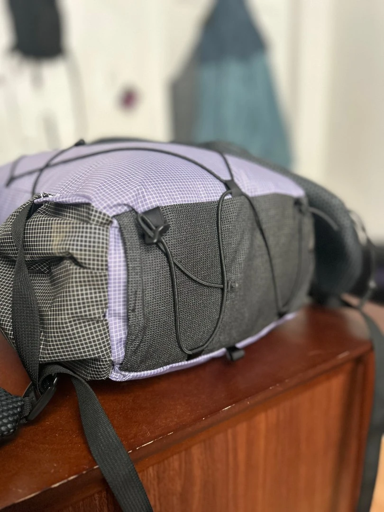
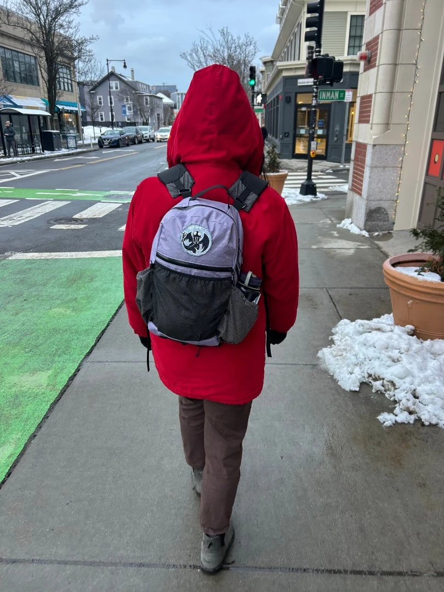

It does look a bit like the Meadowphysics Grasshopper, now that they've started using purple Venom gridstop. My side pockets are more usable in my opinion.

Several lashing points to make it usable enough for hiking, although this is mostly an EDC.

Recovered the side pockets from my old 40L pack.

Experimenting with a bottom area for lashing poles.

